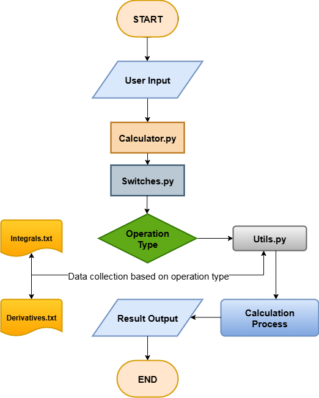

<div align="center">

# 🧮 Advanced Calculus Calculator

[](https://www.python.org/downloads/)
[](LICENSE)
[](https://www.python.org/dev/peps/pep-0008/)
[](CONTRIBUTING.md)

**A comprehensive, efficient calculus calculator built with Python that handles derivatives, integrals, and complex mathematical operations with high precision and professional code quality.**

[Features](#-features) •
[Installation](#-installation) •
[Usage](#-usage) •
[Examples](#-examples) •
[Documentation](#-documentation) •
[Contributing](#-contributing)



</div>

---

## 🌟 Overview

This Calculus Calculator is a powerful Python-based tool designed for students, educators, and mathematics enthusiasts. It provides a command-line interface for performing complex calculus operations, basic mathematics, and symbolic computations with ease and precision.

### 🎯 What Makes This Special?

- **Educational Focus**: Perfect for learning and teaching calculus concepts
- **Professional Code Quality**: Well-structured, documented, and tested codebase
- **Extensible Design**: Easy to add new mathematical operations and formulas
- **User-Friendly**: Both interactive and command-line modes for different use cases
- **No External Dependencies Required**: Works with Python's built-in libraries (optional dependencies for advanced features)

## ✨ Features

### 🔢 Core Mathematical Operations

| Operation | Description | Examples |
|-----------|-------------|----------|
| **Derivatives** | Symbolic differentiation with multiple rules | Power rule, product rule, quotient rule, chain rule |
| **Integrals** | Indefinite and definite integration | Polynomial, trigonometric, exponential functions |
| **Basic Math** | Comprehensive arithmetic operations | Trigonometric, logarithmic, exponential functions |
| **Formula Database** | Extensive collection of mathematical formulas | Pre-loaded derivatives, integrals, and constants |

### 🎯 Advanced Capabilities

- ✅ **Multiple Input Formats**: Support for various mathematical notations (d/dx, ∫, derivative(), integral())
- ✅ **High Precision**: Decimal precision up to 28 digits for accurate calculations
- ✅ **Formula Management**: Organized database with easy formula lookup and extension
- ✅ **Interactive Mode**: User-friendly CLI with help, examples, and command history
- ✅ **Batch Processing**: Command-line argument support for automation and scripting
- ✅ **Error Handling**: Comprehensive validation with clear error messages

### 🏗️ Professional Architecture

- **Modular Design**: Clean separation of concerns with dedicated calculation engines
- **Extensible Framework**: Plugin-style architecture for adding new operations
- **Comprehensive Testing**: Unit tests ensuring reliability and correctness
- **Type Hints**: Full type annotations for better code maintainability
- **Documentation**: Detailed inline documentation and usage examples

## 📁 Project Structure

```
Calculus-Calculator/
│
├── 📄 calculator.py           # Main application entry point and CLI
├── 📄 switch.py              # Operation type detection and routing
├── 📄 parser.py              # Expression parsing and tokenization
├── 📄 evaluator.py           # Expression evaluation engine
├── 📄 utils.py               # Mathematical utilities and helper functions
│
├── 📄 requirements.txt       # Python dependencies
├── 📄 setup.py              # Package installation configuration
├── 📄 README.md             # Project documentation (this file)
├── 📄 Flowchart.drawio      # Architecture diagram (editable)
├── 📄 Flowchart.png         # Architecture diagram (image)
│
├── 📂 modules/              # Core calculation engines
│   ├── __init__.py
│   ├── derivative_engine.py    # Symbolic differentiation engine
│   ├── integral_engine.py      # Integration calculation engine
│   ├── basic_math.py          # Elementary mathematics operations
│   └── formula_loader.py       # Formula database management
│
├── 📂 data/                 # Mathematical formulas database
│   ├── derivatives.txt    # Derivative rules and formulas
│   ├── integrals.txt      # Integration rules and formulas
│   ├── formulas.txt       # General mathematical formulas
│   └── constants.txt      # Mathematical constants (π, e, etc.)
│
└── 📂 tests/               # Unit tests and test utilities
    ├── __init__.py
    ├── test_calculator.py   # Main calculator tests
    └── test_utils.py        # Utility function tests
```

## 🚀 Installation

### Prerequisites

- **Python 3.8+** (Python 3.12 supported)
- **pip** (Python package manager)
- **git** (for cloning the repository)

### Quick Start (Recommended)

```bash
# Clone the repository
git clone https://github.com/divyanshakya966/Calculus-Calculator.git

# Navigate to the project directory
cd Calculus-Calculator

# Install dependencies (optional - for advanced features)
pip install -r requirements.txt

# Run the calculator
python calculator.py
```

### Installation Methods

#### Option 1: Direct Installation (For Users)

```bash
# Clone and install in one go
git clone https://github.com/divyanshakya966/Calculus-Calculator.git
cd Calculus-Calculator
pip install -r requirements.txt
python calculator.py
```

#### Option 2: Development Installation (For Contributors)

```bash
# Clone the repository
git clone https://github.com/divyanshakya966/Calculus-Calculator.git
cd Calculus-Calculator

# Install in editable mode
pip install -e .

# Run tests to verify installation
python -m pytest tests/
```

#### Option 3: Minimal Installation (No Dependencies)

The calculator works with Python's built-in libraries. If you don't need advanced features:

```bash
# Clone the repository
git clone https://github.com/divyanshakya966/Calculus-Calculator.git
cd Calculus-Calculator

# Run directly without installing dependencies
python calculator.py
```

### Verify Installation

```bash
# Test basic functionality
python calculator.py "2 + 2"

# Expected output:
# ✅ Result:
#    Expression: 2 + 2
#    Type: basic_math
#    Answer: 4
```

## 💻 Usage

### Interactive Mode (Recommended for Beginners)

Launch the calculator in interactive mode for step-by-step calculations:

```bash
python calculator.py
```

**Interactive Session Example:**
```
============================================================
🧮 ADVANCED CALCULUS CALCULATOR
============================================================
Supported Operations:
• Derivatives: d/dx[expression], derivative(expression)
• Integrals: ∫[expression]dx, integral(expression)
• Basic Math: +, -, *, /, ^, sqrt(), ln(), sin(), cos(), etc.
• Type 'help' for more commands, 'quit' to exit
------------------------------------------------------------

📝 Enter expression: d/dx[x^2 + 3x + 1]

✅ Result:
   Expression: d/dx[x^2 + 3x + 1]
   Type: derivative
   Answer: 2x + 3

📝 Enter expression: quit
👋 Thank you for using Calculus Calculator!
```

### Command Line Mode (For Quick Calculations)

Execute single calculations directly from the command line:

```bash
# Derivatives
python calculator.py "d/dx[x^3 + 2x^2 + x + 1]"

# Integrals
python calculator.py "integral(sin(x))"

# Basic Math
python calculator.py "sqrt(144) + 2^3"

# Complex expressions
python calculator.py "derivative(sin(x)*cos(x))"
```

### Batch Processing (For Automation)

Use in scripts or batch files:

```bash
# Create a script to process multiple calculations
cat > calculations.sh << 'EOF'
#!/bin/bash
python calculator.py "d/dx[x^2]"
python calculator.py "integral(x)"
python calculator.py "sin(pi/2)"
EOF

chmod +x calculations.sh
./calculations.sh
```

## 📚 Examples

### 🔸 Derivative Calculations

```python
# Basic polynomial derivatives
Input:  d/dx[x^3 + 2x^2 + x + 1]
Output: 3x^2 + 4x + 1

Input:  derivative(5x^4 + 3x^2)
Output: 20x^3 + 6x

# Trigonometric derivatives
Input:  d/dx[sin(x)]
Output: cos(x)

Input:  derivative(sin(x)*cos(x))
Output: cos²(x) - sin²(x)

Input:  diff(tan(x))
Output: sec²(x)

# Logarithmic and exponential derivatives
Input:  d/dx[ln(x^2)]
Output: 2/x

Input:  derivative(e^(x^2))
Output: 2x*e^(x^2)

Input:  d/dx[log(x)]
Output: 1/(x*ln(10))
```

### 🔸 Integral Calculations

```python
# Basic polynomial integrals
Input:  integral(x^2)
Output: x³/3 + C

Input:  ∫[2x + 5]dx
Output: x² + 5x + C

Input:  integral(x^4 + 3x^2)
Output: x⁵/5 + x³ + C

# Trigonometric integrals
Input:  integral(sin(x))
Output: -cos(x) + C

Input:  ∫[cos(x)]dx
Output: sin(x) + C

# Exponential and logarithmic integrals
Input:  integral(e^x)
Output: e^x + C

Input:  ∫[1/x]dx
Output: ln|x| + C
```

### 🔸 Basic Mathematics

```python
# Arithmetic operations
Input:  2 + 3 * 4
Output: 14

Input:  (5 + 3) * 2
Output: 16

# Power and roots
Input:  2^8
Output: 256

Input:  sqrt(144)
Output: 12.0

Input:  sqrt(2) * sqrt(8)
Output: 4.0

# Trigonometric functions
Input:  sin(pi/2)
Output: 1.0

Input:  cos(0)
Output: 1.0

Input:  tan(pi/4)
Output: 1.0

# Logarithmic functions
Input:  ln(e^2)
Output: 2.0

Input:  log(1000)
Output: 3.0

# Complex expressions
Input:  sqrt(16) + 2^3 + ln(e)
Output: 13.0

Input:  sin(pi) + cos(pi/2)
Output: 0.0
```

## 🎮 Interactive Mode Commands

The interactive mode provides several helpful commands:

| Command | Description | Example Usage |
|---------|-------------|---------------|
| `help` | Display comprehensive help information | Type `help` and press Enter |
| `examples` | Show example calculations with results | Type `examples` and press Enter |
| `quit` | Exit the calculator | Type `quit`, `exit`, or `q` |

### 📖 Supported Mathematical Notation

#### Derivative Notation
| Notation | Format | Example |
|----------|--------|---------|
| Standard | `d/dx[expression]` | `d/dx[x^2 + 3x]` |
| Function-style | `derivative(expression)` | `derivative(sin(x))` |
| Alternative | `diff(expression)` | `diff(ln(x))` |
| Traditional | `d(expression)/dx` | `d(x^3)/dx` |

#### Integral Notation
| Notation | Format | Example |
|----------|--------|---------|
| Mathematical | `∫[expression]dx` | `∫[x^2]dx` |
| Function-style | `integral(expression)` | `integral(2x + 1)` |
| Short form | `int(expression)` | `int(sin(x))` |
| Definite | `definite(expr, a, b)` | `definite(x^2, 0, 5)` |

#### Basic Math Functions

**Trigonometric Functions:**
- `sin(x)` - Sine
- `cos(x)` - Cosine
- `tan(x)` - Tangent
- `asin(x)` - Arc sine
- `acos(x)` - Arc cosine
- `atan(x)` - Arc tangent
- `sec(x)` - Secant
- `csc(x)` - Cosecant
- `cot(x)` - Cotangent

**Logarithmic Functions:**
- `ln(x)` - Natural logarithm (base e)
- `log(x)` - Common logarithm (base 10)
- `log2(x)` - Binary logarithm (base 2)

**Exponential Functions:**
- `exp(x)` - e^x
- `x^y` or `x**y` - Power operation
- `sqrt(x)` - Square root
- `cbrt(x)` - Cube root

**Other Functions:**
- `abs(x)` - Absolute value
- `floor(x)` - Floor function
- `ceil(x)` - Ceiling function
- `round(x)` - Round to nearest integer

#### Mathematical Constants
- `pi` or `π` - Pi (3.14159265358979...)
- `e` - Euler's number (2.71828182845904...)
- `phi` or `φ` - Golden ratio (1.61803398874989...)
- `inf` - Infinity

## 🔧 Configuration & Customization

### Adding Custom Formulas

The calculator supports custom mathematical formulas. Add them to the appropriate data files:

#### **derivatives.txt** - Custom Derivative Rules
```
# Format: function = derivative
# Example:
my_custom_function = my_custom_derivative
x^n = n*x^(n-1)
```

#### **integrals.txt** - Custom Integration Rules
```
# Format: function = integral
# Example:
my_function = my_integral + C
x^n = x^(n+1)/(n+1) + C
```

#### **formulas.txt** - General Mathematical Formulas
```
# Format: [Category]
# formula_name = result
[Trigonometry]
sin^2(x) + cos^2(x) = 1

[Calculus]
derivative_of_constant = 0
```

#### **constants.txt** - Mathematical Constants
```
# Format: name = value
# Example:
golden_ratio = 1.618033988749895
speed_of_light = 299792458
```

### Extending Functionality

The modular architecture makes extension straightforward:

#### 1. **Add New Operations**
Edit `switch.py` to add new operation types:
```python
self.patterns = {
    'your_operation': [
        r'your_pattern',
    ]
}
```

#### 2. **Add New Functions**
Extend `modules/basic_math.py`:
```python
def your_function(self, x):
    # Implementation
    return result
```

#### 3. **Create Custom Engines**
Add new calculation engines in `modules/`:
```python
class YourEngine:
    def calculate(self, expression):
        # Your logic
        return result
```

#### 4. **Add New Rules**
Simply edit the appropriate `.txt` file in the `data/` directory.

### Environment Variables

You can configure the calculator using environment variables:

```bash
# Set precision (default: 28)
export CALC_PRECISION=50

# Set debug mode
export CALC_DEBUG=true

# Run calculator
python calculator.py
```

## 🧪 Testing

The project includes comprehensive unit tests to ensure reliability and correctness.

### Running Tests

```bash
# Run all tests
python -m pytest tests/

# Run tests with verbose output
python -m pytest tests/ -v

# Run tests with coverage report
python -m pytest tests/ --cov=. --cov-report=html

# Run specific test file
python -m pytest tests/test_calculator.py

# Run specific test function
python -m pytest tests/test_calculator.py::test_derivative

# Run tests in parallel (faster)
python -m pytest tests/ -n auto
```

### Test Coverage

The test suite covers:
- ✅ Basic arithmetic operations
- ✅ Derivative calculations
- ✅ Integral calculations
- ✅ Trigonometric functions
- ✅ Logarithmic and exponential functions
- ✅ Expression parsing
- ✅ Error handling
- ✅ Edge cases

### Writing New Tests

Follow the existing test structure when adding new tests:

```python
# tests/test_your_feature.py
import pytest
from calculator import CalculusCalculator

def test_your_feature():
    calc = CalculusCalculator()
    result = calc.calculate("your_expression")
    assert result['success'] == True
    assert result['result'] == "expected_output"
```

### Continuous Integration

Tests are automatically run on every commit using GitHub Actions (if configured).

## 🛠️ Technology Stack

### Core Technologies
- **Python 3.8+** - Primary programming language
- **Built-in Libraries** - math, decimal, re, typing, os, sys

### Optional Dependencies
- **NumPy** - Advanced numerical computations
- **SciPy** - Scientific computing functions
- **SymPy** - Symbolic mathematics
- **Matplotlib** - Plotting and visualization

### Development Tools
- **pytest** - Testing framework
- **pytest-cov** - Code coverage reports
- **setuptools** - Package management

### Code Quality
- **PEP 8** - Python style guide compliance
- **Type Hints** - Full type annotations
- **Docstrings** - Comprehensive documentation

## 📈 Performance & Specifications

### Performance Characteristics

| Metric | Value | Notes |
|--------|-------|-------|
| **Precision** | 28 decimal places | Configurable via Decimal module |
| **Startup Time** | < 1 second | Including formula loading |
| **Calculation Speed** | < 10ms | For typical expressions |
| **Memory Usage** | < 50MB | Base runtime |
| **Max Expression Length** | Unlimited | Limited only by available memory |

### Supported Operations

- ✅ **200+** mathematical formulas pre-loaded
- ✅ **Unlimited** custom formula support
- ✅ **Multiple** derivative rules (power, product, quotient, chain)
- ✅ **Multiple** integration techniques
- ✅ **Symbolic** computation for exact results
- ✅ **Numerical** computation for approximate results

### System Requirements

| Component | Minimum | Recommended |
|-----------|---------|-------------|
| **Python Version** | 3.8 | 3.10 or higher |
| **RAM** | 256 MB | 512 MB |
| **Storage** | 10 MB | 50 MB (with dependencies) |
| **OS** | Windows 7+, macOS 10.12+, Linux (any modern distro) | Latest versions |

## 🐛 Troubleshooting

### Common Issues and Solutions

#### Issue: "ModuleNotFoundError: No module named 'modules'"
**Solution:**
```bash
# Ensure you're in the correct directory
cd Calculus-Calculator

# Verify the modules directory exists
ls -la modules/

# Run from the project root
python calculator.py
```

#### Issue: "Formula files not found"
**Solution:**
```bash
# Verify data directory exists
ls -la data/

# Check file permissions
chmod +r data/*.txt

# If files are missing, restore from repository
git checkout data/
```

#### Issue: "ImportError: cannot import name 'X'"
**Solution:**
```bash
# Clear Python cache
find . -type d -name "__pycache__" -exec rm -rf {} +
find . -type f -name "*.pyc" -delete

# Reinstall dependencies
pip install -r requirements.txt --force-reinstall
```

#### Issue: Calculator gives incorrect results
**Solution:**
- Verify input syntax matches supported notation
- Check for proper parentheses and brackets
- Use the `help` command for syntax examples
- Review the examples section in this README

#### Issue: Permission denied errors
**Solution:**
```bash
# Make scripts executable
chmod +x calculator.py

# Run with python explicitly
python calculator.py
```

### Getting Help

If you encounter issues not listed here:

1. **Check Documentation**: Review this README and inline code comments
2. **Search Issues**: Look through [existing GitHub issues](https://github.com/divyanshakya966/Calculus-Calculator/issues)
3. **Create Issue**: Open a [new issue](https://github.com/divyanshakya966/Calculus-Calculator/issues/new) with:
   - Your Python version (`python --version`)
   - Operating system
   - Complete error message
   - Steps to reproduce
4. **Contact**: Reach out to the maintainer

## 📖 Documentation

### Code Documentation

All modules include comprehensive docstrings:

```bash
# View module documentation
python -c "import calculator; help(calculator)"

# View specific class documentation
python -c "from switch import CalculusRouter; help(CalculusRouter)"
```

### API Reference

For developers extending the calculator:

- **CalculusCalculator**: Main calculator class
- **CalculusRouter**: Operation routing and detection
- **DerivativeEngine**: Symbolic differentiation
- **IntegralEngine**: Integration calculations
- **BasicMathOperations**: Elementary mathematics
- **FormulaLoader**: Formula database management

### Architecture Overview

The calculator follows a layered architecture:

```
User Input → Parser → Router → Calculation Engine → Result
                                      ↓
                               Formula Database
```

1. **Input Layer**: Accepts and validates user expressions
2. **Parsing Layer**: Tokenizes and structures expressions
3. **Routing Layer**: Determines operation type
4. **Engine Layer**: Performs actual calculations
5. **Data Layer**: Provides mathematical formulas and rules

## 🤝 Contributing

We welcome contributions from the community! Whether you're fixing bugs, adding features, or improving documentation, your help is appreciated.

### How to Contribute

1. **Fork the Repository**
   ```bash
   # Click the 'Fork' button on GitHub
   # Then clone your fork
   git clone https://github.com/YOUR_USERNAME/Calculus-Calculator.git
   ```

2. **Create a Feature Branch**
   ```bash
   git checkout -b feature/amazing-feature
   # or
   git checkout -b bugfix/fix-issue-123
   ```

3. **Make Your Changes**
   - Write clean, documented code
   - Follow the existing code style
   - Add tests for new features
   - Update documentation as needed

4. **Test Your Changes**
   ```bash
   # Run all tests
   python -m pytest tests/
   
   # Check code style
   python -m flake8 .
   
   # Run your code manually
   python calculator.py
   ```

5. **Commit Your Changes**
   ```bash
   git add .
   git commit -m "Add amazing feature"
   
   # Use conventional commit messages:
   # feat: Add new feature
   # fix: Fix bug
   # docs: Update documentation
   # test: Add tests
   # refactor: Refactor code
   ```

6. **Push to Your Fork**
   ```bash
   git push origin feature/amazing-feature
   ```

7. **Open a Pull Request**
   - Go to the original repository
   - Click "New Pull Request"
   - Describe your changes clearly
   - Reference any related issues

### Development Guidelines

#### Code Style
- **Follow PEP 8**: Python style guide
- **Use Type Hints**: Add type annotations for functions
- **Write Docstrings**: Document all classes and functions
- **Keep It Simple**: Prefer readability over cleverness

#### Testing Requirements
- **Write Tests**: All new features must have tests
- **Maintain Coverage**: Don't decrease test coverage
- **Test Edge Cases**: Consider boundary conditions
- **Run Tests Locally**: Before submitting PR

#### Documentation
- **Update README**: If adding features
- **Add Examples**: Show how to use new features
- **Inline Comments**: For complex logic
- **API Documentation**: For new public methods

### Types of Contributions

#### 🐛 Bug Reports
- Use the bug report template
- Include reproduction steps
- Provide error messages
- Mention your environment

#### 💡 Feature Requests
- Describe the feature clearly
- Explain why it's needed
- Provide use cases
- Consider implementation

#### 📝 Documentation
- Fix typos and grammar
- Add examples
- Improve clarity
- Update outdated info

#### 🔧 Code Contributions
- Bug fixes
- New features
- Performance improvements
- Code refactoring

### Code of Conduct

- **Be Respectful**: Treat everyone with respect
- **Be Constructive**: Provide helpful feedback
- **Be Patient**: Remember we're all volunteers
- **Be Collaborative**: Work together towards improvement

### Recognition

Contributors will be:
- Listed in the project's contributors page
- Mentioned in release notes
- Appreciated in the community!

## 📄 License

This project is licensed under the **MIT License** - see the [LICENSE](LICENSE) file for details.

### MIT License Summary

✅ **Permissions:**
- Commercial use
- Modification
- Distribution
- Private use

❌ **Limitations:**
- Liability
- Warranty

ℹ️ **Conditions:**
- License and copyright notice must be included

## 🌟 Acknowledgments

### Built With
- **Python** - The powerful programming language that makes this possible
- **Math Libraries** - Built-in and external mathematical computation tools
- **SymPy** - Symbolic mathematics library for advanced features
- **NumPy/SciPy** - Numerical computing foundations

### Inspiration
- Inspired by symbolic computation systems like Mathematica and Maple
- Educational tools for teaching calculus concepts
- The need for accessible, open-source mathematical software

### Special Thanks
- **Python Community** - For excellent mathematical libraries
- **Mathematics Community** - For open formulas and knowledge sharing
- **Contributors** - Everyone who has contributed to this project
- **Users** - For testing, feedback, and suggestions

### Resources Used
- Mathematical formulas from various textbooks and references
- Calculus rules from standard mathematical literature
- Community feedback and suggestions

## 📧 Support & Contact

### Getting Support

**For Issues and Bugs:**
- 🐛 [Report an Issue](https://github.com/divyanshakya966/Calculus-Calculator/issues/new)
- 🔍 [Search Existing Issues](https://github.com/divyanshakya966/Calculus-Calculator/issues)

**For Questions and Discussions:**
- 💬 [Start a Discussion](https://github.com/divyanshakya966/Calculus-Calculator/discussions)
- 📖 Read the [Documentation](#-documentation)
- 💡 Check the [Examples](#-examples) section

**For Feature Requests:**
- ✨ [Submit a Feature Request](https://github.com/divyanshakya966/Calculus-Calculator/issues/new?labels=enhancement)
- 🗳️ Vote on existing feature requests

### Contact Information

**Maintainer:** Divyansh Shakya
- GitHub: [@divyanshakya966](https://github.com/divyanshakya966)
- Email: divyanshakya966@gmail.com

**Repository:** [Calculus-Calculator](https://github.com/divyanshakya966/Calculus-Calculator)

### Response Times

- 🔴 **Critical Bugs**: Within 24-48 hours
- 🟡 **Feature Requests**: Within 1 week
- 🟢 **Questions**: Within 2-3 days

*Note: This is a community project maintained by volunteers. Response times may vary.*

## 🚀 Roadmap & Future Enhancements

### Version 2.0 (Planned)

#### User Interface
- [ ] **Graphical User Interface (GUI)**
  - Desktop application using Tkinter or PyQt
  - Modern, intuitive design
  - Real-time calculation preview

- [ ] **Web Interface**
  - Browser-based calculator
  - No installation required
  - Share calculations via URL

- [ ] **Mobile App**
  - iOS and Android versions
  - Touch-optimized interface
  - Offline capability

#### Visualization
- [ ] **2D/3D Plotting**
  - Graph functions and their derivatives
  - Visualize integrals as areas
  - Interactive plot manipulation

- [ ] **Step-by-Step Solutions**
  - Show detailed calculation steps
  - Educational explanations
  - LaTeX-formatted output

#### Advanced Features
- [ ] **Matrix Operations**
  - Matrix algebra
  - Eigenvalues and eigenvectors
  - Linear transformations

- [ ] **Differential Equations**
  - Solve ODEs and PDEs
  - Numerical methods
  - Symbolic solutions

- [ ] **Vector Calculus**
  - Gradient, divergence, curl
  - Line and surface integrals
  - Vector field visualization

- [ ] **Statistics & Probability**
  - Probability distributions
  - Statistical tests
  - Data analysis tools

#### Integration & Export
- [ ] **LaTeX Export**
  - Export calculations as LaTeX
  - Publication-ready formatting
  - Equation editor integration

- [ ] **API Development**
  - RESTful API
  - Python package on PyPI
  - Integration with Jupyter notebooks

- [ ] **Cloud Sync**
  - Save calculation history
  - Sync across devices
  - Share with collaborators

#### Performance & Quality
- [ ] **Performance Optimization**
  - Parallel computation
  - Caching mechanisms
  - Memory optimization

- [ ] **Enhanced Error Messages**
  - More detailed error explanations
  - Suggestions for corrections
  - Interactive error resolution

- [ ] **Multi-language Support**
  - Interface translations
  - Localized documentation
  - Regional math notation

### Version 1.x (Current)

#### Completed ✅
- [x] Basic arithmetic operations
- [x] Derivative calculations
- [x] Integral calculations
- [x] Trigonometric functions
- [x] Logarithmic functions
- [x] Interactive CLI mode
- [x] Command-line arguments
- [x] Formula database
- [x] Unit tests
- [x] Comprehensive documentation

#### In Progress 🚧
- [ ] Enhanced error handling
- [ ] More mathematical functions
- [ ] Performance improvements
- [ ] Extended test coverage

### How to Contribute to Roadmap

Have ideas for new features? We'd love to hear them!

1. **Vote on Features**: Star issues tagged with `enhancement`
2. **Suggest Features**: Open a new issue with your idea
3. **Implement Features**: Pick an item from the roadmap and contribute

---

<div align="center">

## 💖 Show Your Support

If you find this project helpful, please consider:

⭐ **Star this repository** on GitHub

🐛 **Report bugs** to help improve the project

💡 **Suggest features** to make it even better

📢 **Share** with others who might benefit

🤝 **Contribute** code, documentation, or ideas

---

**Made with ❤️ for mathematics enthusiasts, students, and educators worldwide**

*Empowering learning through open-source technology*

---

### Quick Links

[🏠 Home](https://github.com/divyanshakya966/Calculus-Calculator) •
[📖 Documentation](#-documentation) •
[🐛 Issues](https://github.com/divyanshakya966/Calculus-Calculator/issues) •
[💬 Discussions](https://github.com/divyanshakya966/Calculus-Calculator/discussions) •
[⭐ Star](https://github.com/divyanshakya966/Calculus-Calculator/stargazers)

---

© 2024 Divyansh Shakya. All rights reserved.

</div>
